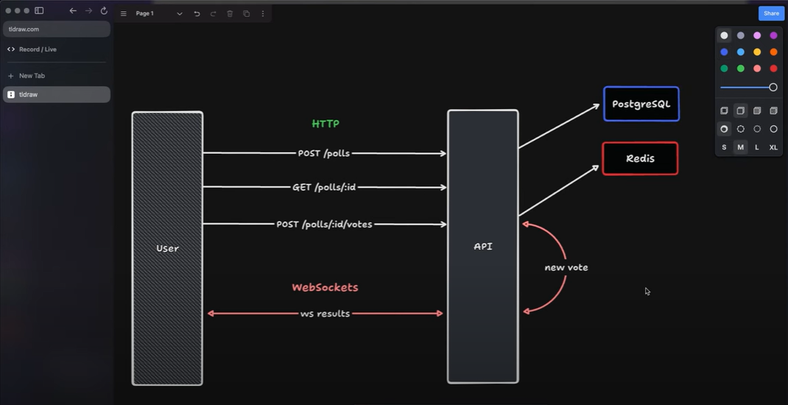
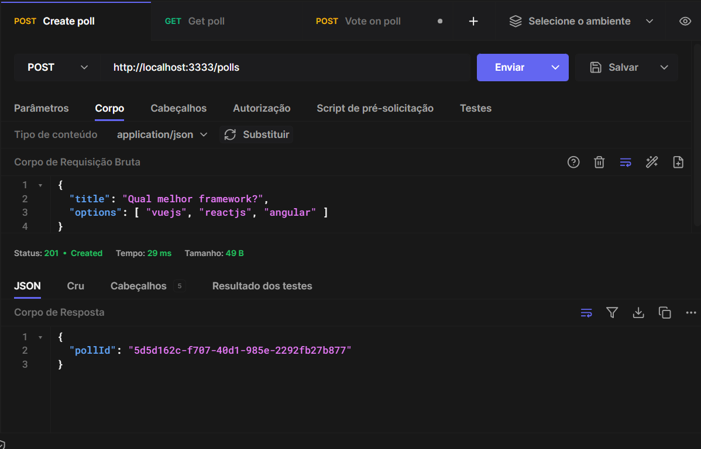
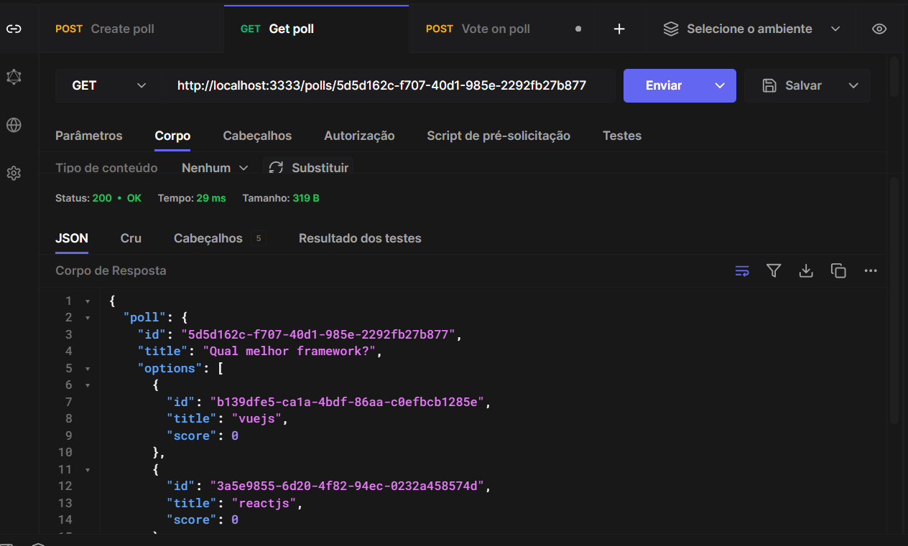
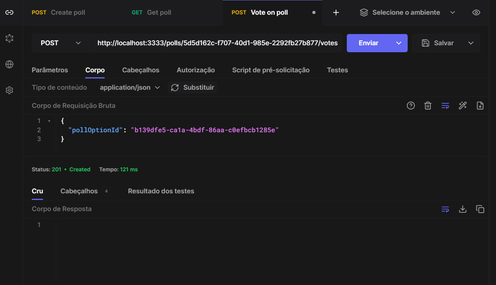
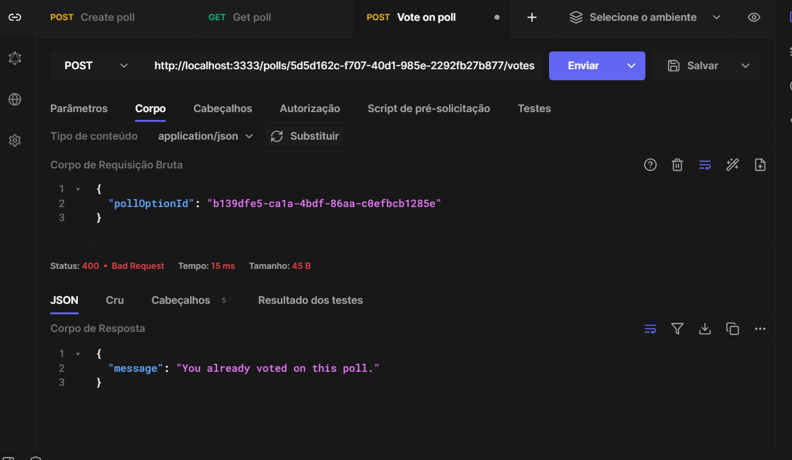
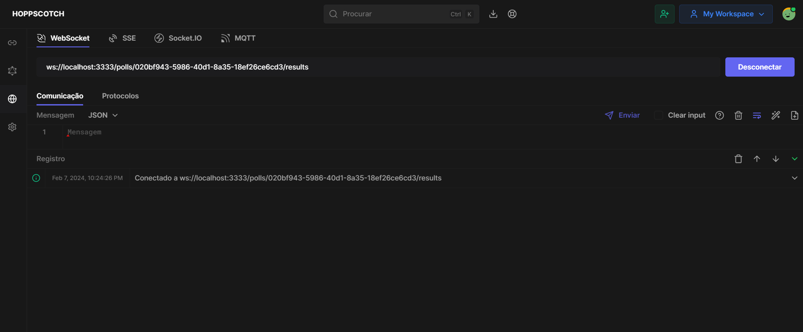

<h1 align="center">
  Aplicação Backend desenvolvida durante a Trilha NodeJS no evento NLW Expert da Rocketseat em 2024.
</h1>

[](./LICENSE)

---

## 📁 Sobre o projeto

Aprofundando os conhecimentos com a tecnologia Node.JS configurando e desenvolvendo um projeto completo do zero de enquetes.
Esta API consiste em um sistema de votação em tempo real onde os usuários podem criar uma enquete e outros usuários podem votar. O sistema gera um ranking entre as opções e 
atualiza os votos em tempo real.

---

## Schema da API

<div>
    
</div>

---

## 📷 Screenshots

### Create poll
<div>
    
</div>

<br>

### Get poll
<div>
    
</div>

### Vote on poll
<div>
     <br>
    
</div>

### Websocket
<div>
    
</div>

---

## Requisitos

- Node.js versão 20 ou superior;
- Docker.

---

## 💻 Tecnologias utilizadas

- Prisma
- Redis
- Fastify
- Zod
- Docker
- Typescript

---

## 💡 Utilização
1. Clone o projeto:

```
$ git clone https://github.com/JaasielAntunes/nlw2024-node-enquete.git
```

2. Acesse a pasta do projeto:

```
$ cd nlw2024-node-enquete
```

3. Instale as dependências:

```
$ npm install
```

4. Execute:

```
$ docker compose up -d
```
```
$ npm run migrate:run
```

5. Inicie o servidor:

```
$ npm run dev
```

## 💻 HTTP

### POST `/polls`

Criar nova enquete.

#### Corpo da requisição

```json
{
  "title": "Qual a melhor linguagem de programação?",
  "options": [
    "JavaScript",
    "Java",
    "PHP",
    "C#"
  ]
}
```

#### Corpo de resposta

```json
{
  "pollId": "194cef63-2ccf-46a3-aad1-aa94b2bc89b0"
}
```

### GET `/polls/:pollId`

Retorne dados de uma única enquete.

#### Corpo de resposta

```json
{
	"poll": {
		"id": "e4365599-0205-4429-9808-ea1f94062a5f",
		"title": "Qual a melhor linguagem de programação?",
		"options": [
			{
				"id": "4af3fca1-91dc-4c2d-b6aa-897ad5042c84",
				"title": "JavaScript",
				"score": 1
			},
			{
				"id": "780b8e25-a40e-4301-ab32-77ebf8c79da8",
				"title": "Java",
				"score": 0
			},
			{
				"id": "539fa272-152b-478f-9f53-8472cddb7491",
				"title": "PHP",
				"score": 0
			},
			{
				"id": "ca1d4af3-347a-4d77-b08b-528b181fe80e",
				"title": "C#",
				"score": 0
			}
		]
	}
}
```

### POST `/polls/:pollId/votes`

Adicione um voto a uma enquete específica.

#### Request body

```json
{
  "pollOptionId": "31cca9dc-15da-44d4-ad7f-12b86610fe98"
}
```

## WebSockets

### ws `/polls/:pollId/results`

#### Message

```json
{
  "pollOptionId": "da9601cc-0b58-4395-8865-113cbdc42089",
  "votes": 2
}
```

---

## ✅ Sugestão
- Utilize o Postman ou Insomnia para testar as requisições.
---

<h4 align="center">
  Feito com ❤️ por Jaasiel Antunes - <a href="mailto:contato.jaasiel@gmail.com.com">Entre em contato!</a>
</h4>

<p align="center">
  <a href="https://www.linkedin.com/in/jaasiel-antunes-1517b41bb/">
    
  </a>
</p>
